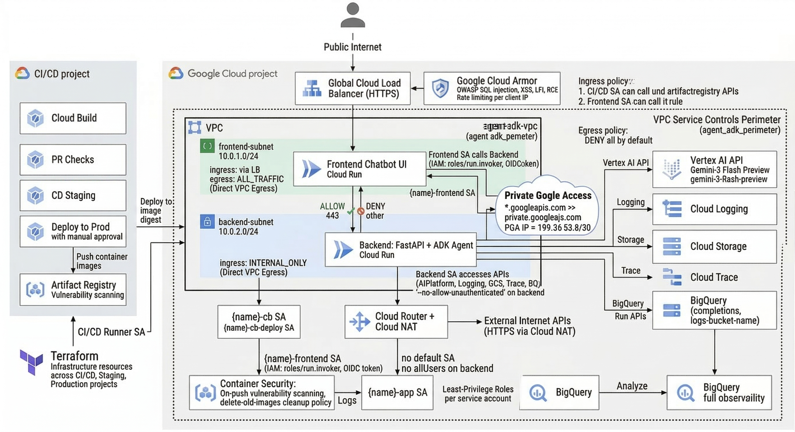

# agent-vpc-demo

A conversational AI chatbot built on the [Google Agent Development Kit (ADK)](https://google.github.io/adk-docs/) and deployed to Google Cloud Run. The system uses a two-tier architecture: a public-facing **frontend** chatbot UI communicates with a private **backend** FastAPI server hosting a ReAct agent powered by Gemini 3 Flash Preview via Vertex AI.

## System Architecture

```
                        Internet
                           |
                   +-------+-------+
                   |  Cloud Load   |
                   |  Balancer     |
                   | (HTTPS + WAF) |
                   +-------+-------+
                           |
                   +-------+-------+
                   |   Frontend    |    frontend-subnet (10.0.1.0/24)
                   |  (Cloud Run)  |    Direct VPC Egress
                   |  Chatbot UI   |
                   +-------+-------+
                           |
              VPC internal (10.0.1.x -> 10.0.2.x)
              HTTPS + OIDC identity token
                           |
                   +-------+-------+
                   |   Backend     |    backend-subnet (10.0.2.0/24)
                   |  (Cloud Run)  |    Direct VPC Egress
                   |  FastAPI +    |    Ingress: INTERNAL_ONLY
                   |  ADK Agent    |
                   +-------+-------+
                        |      |
             +----------+      +----------+
             |                            |
   +---------+--------+    +-------------+----------+
   | Vertex AI API    |    | Cloud Logging /        |
   | (Gemini Model)   |    | Cloud Trace / BigQuery |
   | Private Google   |    | GCS Artifacts Bucket   |
   | Access           |    |                        |
   +------------------+    +------------------------+
```


- **Frontend** -- Lightweight chatbot UI in a public subnet. Accepts user messages over HTTPS and streams responses in real time via SSE.
- **Backend** -- FastAPI server hosting a Google ADK agent in a private subnet. Inaccessible from the internet; only reachable from the frontend via Direct VPC Egress with IAM-authenticated service-to-service calls.
- **Vertex AI** -- Gemini 3 Flash Preview model accessed over Private Google Access. The agent uses a ReAct pattern with tool-calling (weather, time lookups).
- **Observability** -- OpenTelemetry exports traces to Cloud Trace, completion metadata to GCS/BigQuery, and structured logs to Cloud Logging with 10-year retention.
- **CI/CD** -- Three-project isolation (CI/CD, Staging, Production) with Cloud Build. PRs trigger tests; merges to main deploy to staging with load testing; production requires manual approval.

For the full design, see [`docs/sdd.md`](docs/sdd.md). For network and security implementation details (Terraform, firewall rules, VPC-SC), see [`docs/network_security.md`](docs/network_security.md).

## Project Structure

```
agent-vpc-demo/
+-- backend/                          # ADK agent + FastAPI server
|   +-- agent.py                      # Agent definition, tools, model config
|   +-- fast_api_app.py               # FastAPI server (SSE, feedback, sessions)
|   +-- app_utils/                    # Telemetry and Pydantic models
+-- frontend/                         # Chatbot UI (vanilla HTML/JS + FastAPI proxy)
|   +-- server.py                    # Proxy server with OIDC auth
|   +-- static/                      # HTML, CSS, JS chat interface
|   +-- Dockerfile                   # Frontend container image
+-- .cloudbuild/                      # CI/CD pipeline configurations
+-- deployment/                       # Terraform infrastructure
+-- tests/                            # Unit, integration, load, and eval tests
+-- docs/                             # Software design document
+-- Makefile                          # Development commands
+-- pyproject.toml                    # Project dependencies
```

> Use [Gemini CLI](https://github.com/google-gemini/gemini-cli) for AI-assisted development -- project context is pre-configured in `GEMINI.md`.

## Requirements

Before you begin, ensure you have:
- **uv**: Python package manager - [Install](https://docs.astral.sh/uv/getting-started/installation/) ([add packages](https://docs.astral.sh/uv/concepts/dependencies/) with `uv add <package>`)
- **Google Cloud SDK**: For GCP services - [Install](https://cloud.google.com/sdk/docs/install)
- **Terraform**: For infrastructure deployment - [Install](https://developer.hashicorp.com/terraform/downloads)
- **make**: Build automation tool - [Install](https://www.gnu.org/software/make/) (pre-installed on most Unix-based systems)

## Quick Start

Install required packages and launch the local development environment using the Makefile:

```bash
make install && make playground
```

Alternatively, you can run the full multi-container application locally using Docker Compose:

```bash
docker compose up -d
```
This will start both the backend FastAPI server and the frontend UI proxy, connected over a local Docker network.

## Commands

| Command              | Description                                                |
| -------------------- | ---------------------------------------------------------- |
| `make install`       | Install dependencies using uv                              |
| `make playground`    | Launch local development environment                       |
| `make lint`          | Run code quality checks                                    |
| `make test`          | Run unit and integration tests                             |
| `make deploy`        | Deploy agent to Cloud Run                                  |
| `make local-backend` | Launch local development server with hot-reload            |
| `make local-frontend`| Launch local frontend chatbot UI (connects to local-backend)|
| `make deploy-frontend`| Deploy frontend to Cloud Run                              |
| `make setup-dev-env` | Set up development environment resources using Terraform   |

For full command options and usage, refer to the [Makefile](Makefile).

## Development

Edit your agent logic in `backend/agent.py` and test with `make playground` -- it auto-reloads on save.
For full-stack local development, run `make local-backend` and `make local-frontend` in separate terminals.

## Deployment

```bash
gcloud config set project <your-project-id>
make deploy           # Deploy backend
make deploy-frontend  # Deploy frontend
```
To set up your production infrastructure (VPC, subnets, LB, WAF, CI/CD), apply the Terraform configurations in `deployment/terraform/`.

## Observability

Built-in telemetry exports to Cloud Trace, BigQuery, and Cloud Logging.
